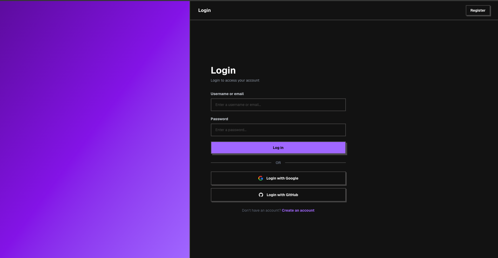
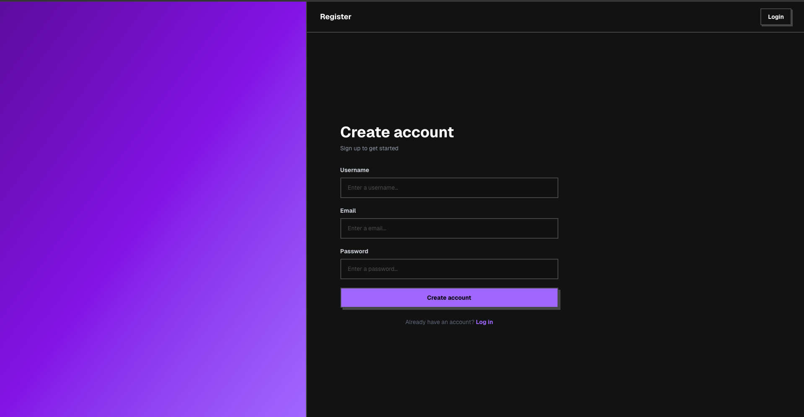
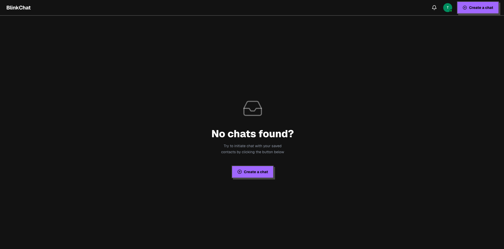
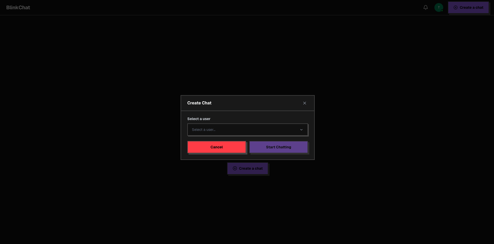
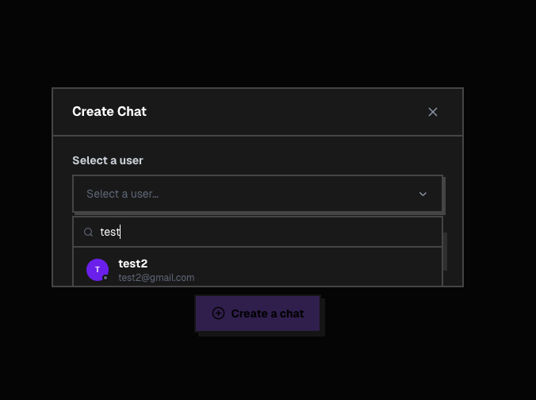
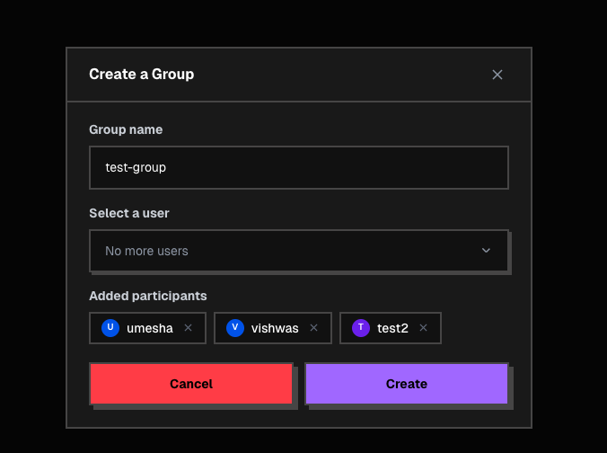
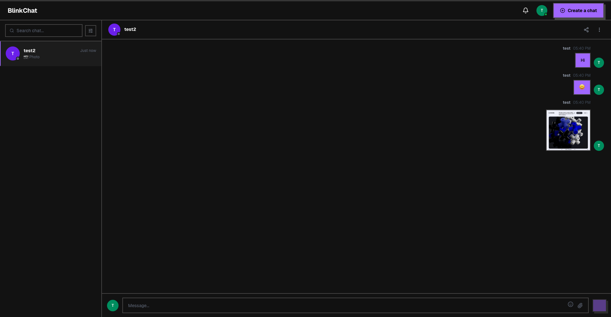

# BlinkChat

A full-stack real-time chat application built with Next.js, Express.js, Socket.IO, and MongoDB.

**Live Demo:** [https://chat-app-98n7.vercel.app](https://chat-app-98n7.vercel.app)

---

## Screenshots

### Login


### Register


### Inbox (Empty State)


### Create a Chat


### Search Users


### Create a Group


### Chat Interface


---

## Features

- **Real-time messaging** via Socket.IO
- **One-on-one & group chats**
- **Photo sharing** with Cloudinary uploads
- **Emoji support** in messages
- **Online presence** indicators
- **JWT authentication** with refresh token rotation
- **OAuth login** via Google and GitHub
- **Search users** to start new conversations
- **Responsive dark UI** with Neobrutalism design system

---

## Tech Stack

### Frontend
| Technology | Version |
|---|---|
| Next.js | 16 (App Router) |
| React | 19 |
| Tailwind CSS | v4 |
| Zustand | v5 |
| Socket.IO Client | v4 |
| TypeScript | v5 |

### Backend
| Technology | Version |
|---|---|
| Node.js / Express.js | v4 |
| MongoDB / Mongoose | v8 |
| Socket.IO | v4 |
| Passport.js | Google + GitHub OAuth |
| JWT | jsonwebtoken v9 |
| Cloudinary | v2 (file uploads) |
| Helmet + Rate Limiting | security |

---

## Project Structure

```
chat-app/
├── backend/          # Express.js API + Socket.IO server
│   ├── src/
│   │   ├── controllers/
│   │   ├── models/
│   │   ├── routes/
│   │   ├── middleware/
│   │   ├── socket/
│   │   └── app.js
│   └── server.js
└── my-app/           # Next.js frontend
    ├── app/
    ├── components/
    └── store/
```

---

## Getting Started

### Prerequisites
- Node.js 18+
- MongoDB Atlas account
- Cloudinary account
- Google & GitHub OAuth app credentials

### Backend Setup

```bash
cd backend
npm install
```

Create a `.env` file:

```env
PORT=4000
MONGODB_URI=your_mongodb_uri
JWT_SECRET=your_jwt_secret
JWT_EXPIRES_IN=7d

GOOGLE_CLIENT_ID=your_google_client_id
GOOGLE_CLIENT_SECRET=your_google_client_secret

GITHUB_CLIENT_ID=your_github_client_id
GITHUB_CLIENT_SECRET=your_github_client_secret

CLIENT_URL=http://localhost:3000
APP_URL=http://localhost:4000

CLOUDINARY_CLOUD_NAME=your_cloud_name
CLOUDINARY_API_KEY=your_api_key
CLOUDINARY_API_SECRET=your_api_secret
```

```bash
npm run dev
```

### Frontend Setup

```bash
cd my-app
npm install
```

Create a `.env.local` file:

```env
NEXT_PUBLIC_API_URL=http://localhost:4000
NEXT_PUBLIC_SOCKET_URL=http://localhost:4000
```

```bash
npm run dev
```

Open [http://localhost:3000](http://localhost:3000)

---

## Deployment

| Service | Platform |
|---|---|
| Frontend | [Vercel](https://vercel.com) |
| Backend | [Render](https://render.com) |
| Database | MongoDB Atlas |
| File Storage | Cloudinary |

---

## License

MIT
